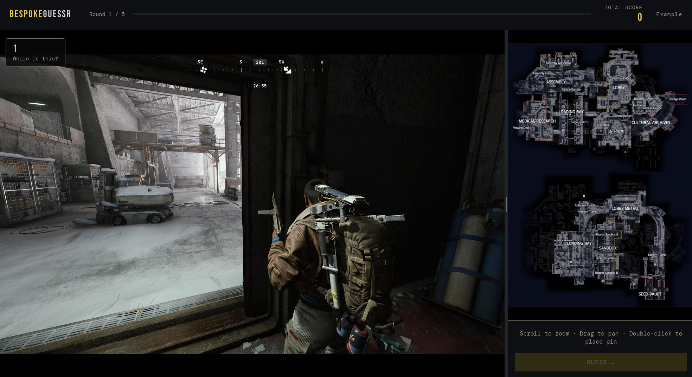

# BespokeGuessr



Make your own GeoGuessr-style game using your own map and locations. Upload a map image, upload location images, drop pins where each image belongs, and share a self-contained guessing game that anyone can play in their browser — no account, no server, no build step required.

Originally built for learning video game maps, but works for anything: city maps, building floorplans, national parks, transit systems, or anywhere else you want to build spatial memory.

## Examples
- [Here is a pre-made example](https://vmmurph.github.io/bespokeguessr/example/)
- [Go here to set up your own geo guessr style game](https://vmmurph.github.io/bespokeguessr/bespokeguessr_setup.html)

## Quick start — single file download

> **Warning:** This approach bakes all images into the HTML as base64. A game with many high-resolution images can easily produce a file that is very large. Compressing your images before uploading is strongly recommended.

1. Open `bespokeguessr_setup.html` in any modern browser
2. Upload a map image and add location photos
3. Place each location on the map
4. Hit **Export Preset** — this downloads a single `bespokeguessr-preset.html` file with everything embedded
5. Share or host that file anywhere — it opens straight into game mode

The exported file is completely self-contained. It can be attached to an email, dropped on itch.io, or committed to a GitHub Pages repo and played immediately.

## Better option — host with separate image files

If you want to web host your guessr game you could host the exported preset with the instructions above, but any user will be downloading all images the first time they load it up — which is very slow. To host with separate files, follow these instructions:

1. Open `bespokeguessr_setup.html` in any modern browser
2. Upload a map image and add location photos
3. Place each location on the map using the "place" buttons (or upload your locations.json file if you did this before)
4. Export locations.json using the "SAVE COORDS" button
5. Mimic the example in the "example" folder with your own map and location images, and your own locations.json. Leave index.html as it is
6. Web host the folder

You can use png or jpg for the map/location images. Your directory should look like the following:

```
your-guessr-game/
  index.html
  map.jpg
  location1.jpg
  location2.jpg
  location3.jpg
```

## SAVE COORDS button

This downloads a locations.json file that saves off the locations you specified on the map for each location. If you need to make changes in the future, this file is very useful so you don't have to re-place all those pins again. I would highly recommend you save it somewhere after you place all the location pins.

The locations.json saves the location filename and the corresponding coordinates on the map image, so the file will work in the future as long as you don't change the map image and you don't change the location image filenames. 

## How to play

- You are shown a location image and must double-click the map to place your guess
- Hit **Guess** to submit — the correct location is revealed in green with a dashed line to your guess
- Score up to 1000 points per round based on how close your guess is
- After all rounds, a results screen shows your total and a per-location breakdown


## Scoring

Distance is measured as a fraction of the map's diagonal.

- **1000 pts** — perfect or near-perfect
- **0 pts** — more than ~40% of the map diagonal away

## License

[GNU Affero General Public License v3.0](LICENSE) — free to use, modify, and share, provided derivatives remain open source under the same license.

---

Most of this project was built with [Claude Code](https://claude.ai/code).
